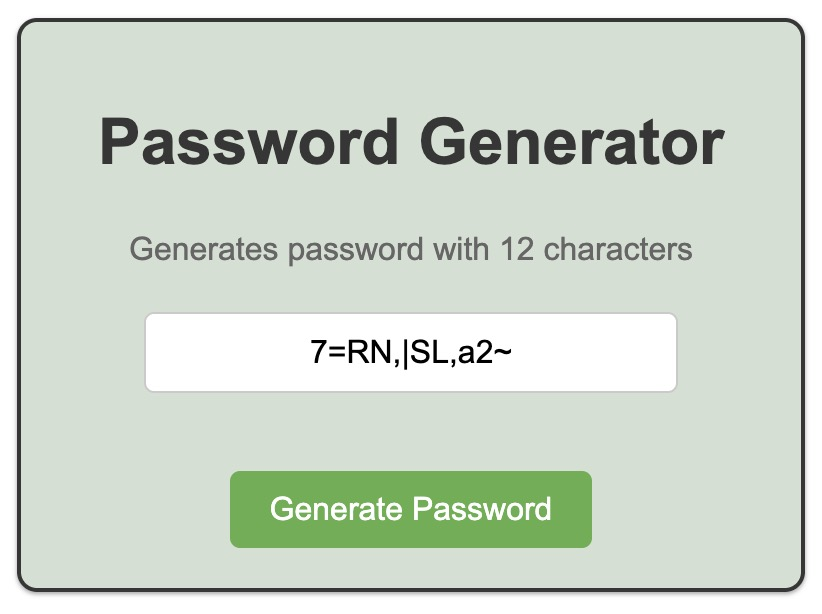

# Password Generator

A simple JavaScript application that generates secure and random passwords with 12 characters.

## Features
- Generate strong and random passwords
- 12-character length
- Copy password to clipboard with one click

## Technologies Used
- HTML
- CSS
- JavaScript

## How to Use
1. Click **Generate** to create a random password.
2. Copy the password with one click.

## Screenshot
```bash
   git clone https://github.com/amirh963/password-generator/tree/main


